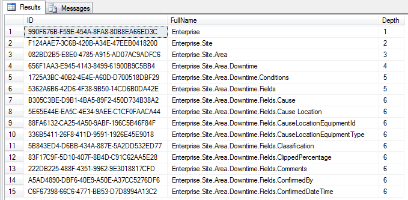
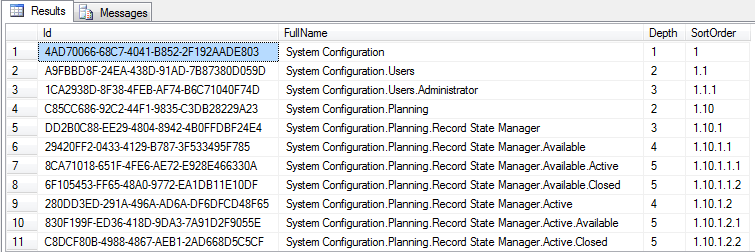
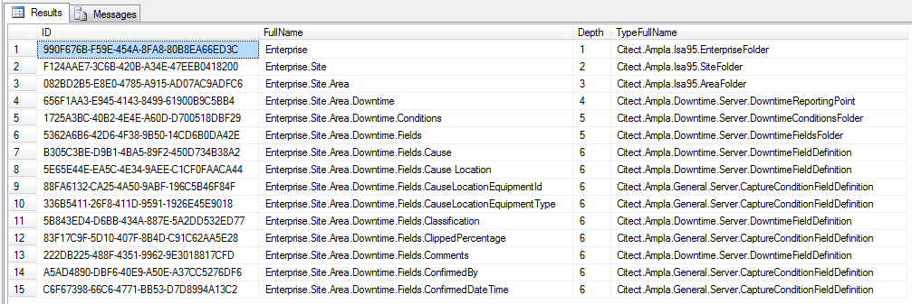
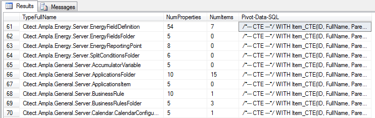
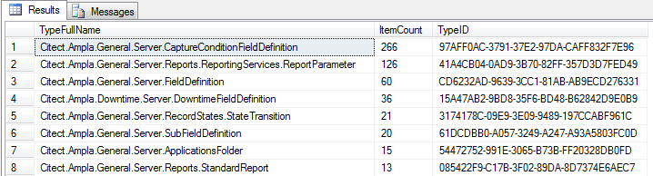
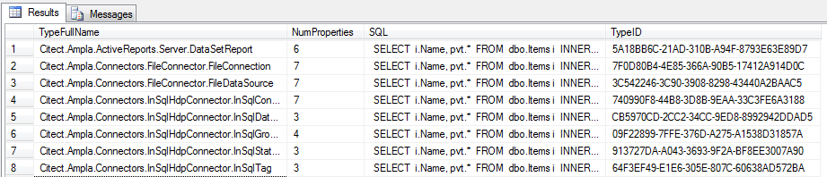

Ampla Project Scripts
===

A set of scripts for understanding the Ampla Project configuration database

----------

###Item.FullName.sql###

Source: [SQL](Item.FullName.sql)

Lists the full names of all the items and their depths in the project structure.

Output:

----------

###Item.FullName.Sorted.sql###

Source: [SQL](Item.FullName.Sorted.sql)

Lists the full names of all the items and their depths in the project structure plus the relative sort order 

Output:

----------

###Item.FullName.Type.sql###

Source: [SQL](Item.FullName.Types.sql)

Lists the full names of all the items, their types, and the depth in the project structure.

Output:

----------

###Item.FullName.Property.Pivot.sql###

Source: [SQL](Item.FullName.Property.Pivot.sql)

Generates a SQL command for each type that will output all the item fullnames and pivot out each of the properties into a table.

Output:

----------

###Item.Count.Types.sql###

Source: [SQL](Item.Count.Types.sql)

Lists the number of types of items and their count in the project.

Output:

----------

###Item.Property.Pivot.sql###

Source: [SQL](Item.Property.Pivot.sql)

Generates a SQL Script for each type that will pivot the results for each type.

Output:

----------

###Item.TraceLevel.sql###

Source: [SQL](Item.TraceLevel.sql)

Lists all properties who have a TraceLevel that is higher than the default setting.

Output:

----------