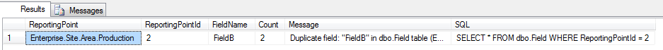
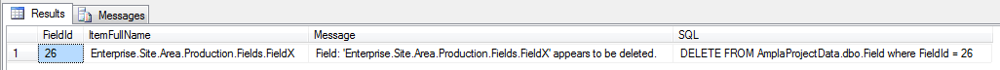

Database Integrity Checks
===

A set of scripts to check the integrity of the Ampla Data Repository

----------

###DataRepository.Field.Duplicates.sql###

Source: [SQL](DataRepository.Field.Duplicate.sql)

Checks for duplicates records in the Field table. 

Output:

----------

###DataRepository.Field.Deleted.sql###

Source: [SQL](DataRepository.Field.Deleted.sql)

Checks for fields that have been deleted from the Ampla project in the Field table. 

Output:

----------

###Database.Trustworthy.sql###

Source: [SQL](Database.Trustworthy.sql)

Checks to see if the database has .NET assemblies installed and checks the database's TRUSTWORTHY state.

This is used to solve errors like this that can occur when a database is restored from another server.

    Msg 10314, Level 16, State 11, Line 1
    An error occurred in the Microsoft .NET Framework while trying to load assembly id 65536. 
    The server may be running out of resources, or the assembly may not be trusted with PERMISSION_SET = EXTERNAL_ACCESS or UNSAFE. 
    Run the query again, or check documentation to see how to solve the assembly trust issues. 
    
    For more information about this error: 
    
    System.IO.FileLoadException: Could not load file or assembly 'citect.ampla.public.mssql.data.v200806, 
    Version=5.2.6135.0, Culture=neutral, PublicKeyToken=13aaee2494f61799' or one of its dependencies. An error relating to security occurred. (Exception from HRESULT: 0x8013150A)
    System.IO.FileLoadException: 
       at System.Reflection.Assembly._nLoad(AssemblyName fileName, String codeBase, Evidence assemblySecurity, Assembly locationHint, StackCrawlMark& stackMark, Boolean throwOnFileNotFound, Boolean forIntrospection)
       at System.Reflection.Assembly.InternalLoad(AssemblyName assemblyRef, Evidence assemblySecurity, StackCrawlMark& stackMark, Boolean forIntrospection)
       at System.Reflection.Assembly.InternalLoad(String assemblyString, Evidence assemblySecurity, StackCrawlMark& stackMark, Boolean forIntrospection)
       at System.Reflection.Assembly.Load(String assemblyString)

Output:

----------