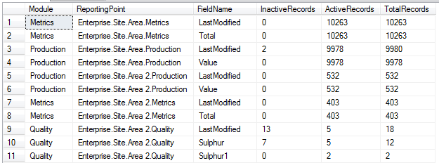

Reporting Point Scripts
===

A set of scripts to list the number of records in the Data repository 

----------

### Module.RecordCounts.sql ###

Source: [SQL](Module.RecordCounts.sql)

Outputs the number of records for each reporting point in the data repository

Output:

----------

### Module.FieldCounts.sql ###

Source: [SQL](Module.FieldCounts.sql)

Outputs the number of fields in the data repository including the number of active records.

Output:

----------
