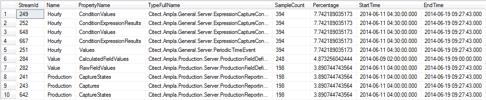
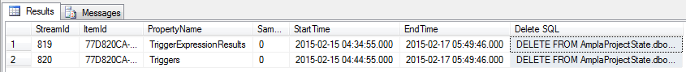

Runtime Stream Scripts
===

A set of scripts to output the number and size of the streams in the state database.

----------

###Streams.SampleCount.sql###

Source: [SQL](Streams.SampleCount.sql)

Outputs each of the streams in the state database showing their start and end time as well as the number of samples stored.

Output:



----------

###Streams.Orphaned.sql###

Source: [SQL](Streams.Orphaned.sql)

Checks to see if there is any orphaned Streams in the State database and outputs SQL script to delete them

Output:



```sql
	DELETE FROM AmplaProjectState.dbo.SampleStoreSampleStream WHERE StreamId=819
	DELETE FROM AmplaProjectState.dbo.SampleStoreSampleStream WHERE StreamId=820
```
----------

